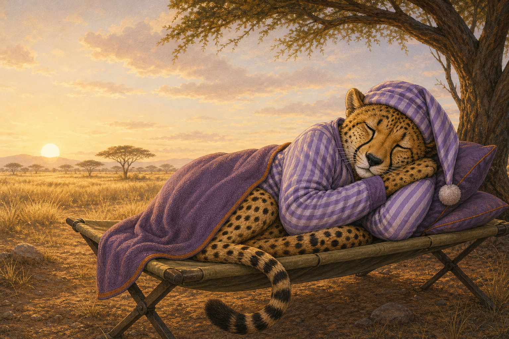
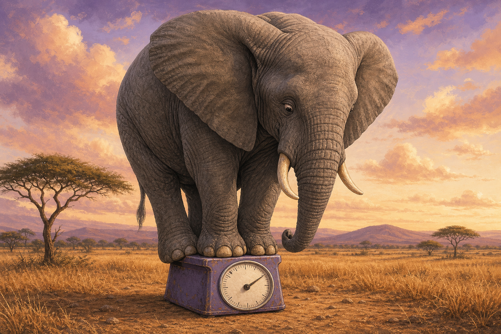

---
format:
  revealjs:
    slide-number: true
    theme: [default, ../theme/presentation_theme.scss, ../theme/presentation_components.scss]
    embed-resources: true
    preview-links: false
    output-file: "presentation"
    output-ext: "html"
    highlight-style: github-light
    include-in-header: "../theme/fonts-include.html"
filters:
  - ../theme/rn-shorthand.lua
  - ../_extensions/EmilHvitfeldt/roughnotation/rough.lua
---

```{r}
#| label: setup
#| include: false
options(htmltools.dir.version = FALSE)
knitr::opts_chunk$set(
  fig.width = 7,
  fig.height = 5,
  fig.align = "center",
  out.width = "100%"
)

library(here)

here::i_am("Presentation/presentation.qmd")

path_materials <- "Presentation/Materials"

dir.create(
  here::here(path_materials),
  recursive = TRUE,
  showWarnings = FALSE
)

source(
  here::here(
    "R",
    "set_r_theme.R"
  )
)

include_local_figure <- function(data_source) {
  knitr::include_graphics(
    path = here::here(
      path_materials,
      data_source
    ),
    error = TRUE
  )
}
```

```{r}
#| label: dynamic-link-generation
#| include: false
project_name <-
  basename(here::here())

display_name <-
  "Biostatistika"

github_url <-
  stringr::str_glue(
    "https://github.com/CUNI-NATUR-Biostatistics/{project_name}"
  )

slides_url <-
  stringr::str_glue(
    "https://CUNI-NATUR-Biostatistics.github.io/{project_name}/"
  )
```

## Co váží „typický“ savec?

<br>

::: {.text-color-white .text-font-heading .text-size-heading1 .text-bold}
`r display_name`
:::

<br>

[👤](https://ondrejmottl.github.io/) Ondřej Mottl

[Moodle](https://dl2.cuni.cz/course/view.php?id=106)

## Kolik váží běžný savec?

<br>

```{r}
#| label: pripravit-hmotnost-pro-titulky
#| include: false
#| message: false
#| warning: false
vec_hmotnost_kg <-
  ggplot2::msleep[["bodywt"]]

prumer_hmotnosti <-
  mean(vec_hmotnost_kg)

median_hmotnosti <-
  median(vec_hmotnost_kg)

txt_prumer_hmotnosti <-
  formatC(
    prumer_hmotnosti,
    format = "f",
    digits = 0,
    decimal.mark = ","
  )

txt_median_hmotnosti <-
  formatC(
    median_hmotnosti,
    format = "f",
    digits = 2,
    decimal.mark = ","
  )
```

:::: {.columns .align-top}

::: {.column width="48%"}
::: {.card-data}
[Smyšlený titulek A]{.card-title}

**Vědci spočítali:**<br>
„Průměrný (*mean*) savec váží
[**`r txt_prumer_hmotnosti` kg**]{.text-hgl-indigo_velvet}.“
:::
:::

::: {.column width="48%"}
::: {.card-data}
[Smyšlený titulek B]{.card-title}

**Jiná analýza tvrdí:**<br>
„Běžný savec (*median*) váží jen
[**`r txt_median_hmotnosti` kg**]{.text-hgl-amethyst}.“
:::
:::

::::

::: {.fragment}
*Stejná tabulka. Dvě dramaticky odlišná čísla.*
:::

## Výsledky učení

<br>

Po dnešní přednášce budete schopni:

::: {.incremental}
- vysvětlit, co v tabulce představuje [jeden řádek]{.text-hgl-graphite}
- přečíst vhodný [graf jedné proměnné]{.text-hgl-graphite}
- vybrat smysluplnou dvojici [středu]{.text-hgl-indigo_velvet} a [rozptýlení]{.text-hgl-orange}
- rozlišit čtyři [typy proměnných]{.text-hgl-indigo_velvet} a zvolit jejich první popis
- vysvětlit, proč jedno správně vypočtené číslo ještě nemusí být dobrý titulek
:::

## Jak budeme dnes pracovat?

::::: {.slide-margin-top-15}

::: {.takeaway-strip}
**Otázka → data → graf → souhrn → opatrná interpretace**
:::

<br>

:::: {.columns .align-top}

::: {.column width="48%"}
::: {.panel-data}
[Na přednášce]{.panel-title}

Budete odhadovat, hlasovat, porovnávat grafy a obhajovat závěry.
:::
:::

::: {.column width="48%"}
::: {.panel-note}
[V materiálech]{.panel-title}

HTML nabízí záložky a rozbalovací otázky; PDF je vhodné pro souvislé čtení.
:::
:::

::::

:::::

## Hlasování: který titulek je správný?

::::: {style="height: 510px; display: flex; flex-direction: column; justify-content: space-between;"}

:::: {.columns .align-stretch}

::: {.column width="48%"}
::: {.card-data .card-compact}
[Titulek A]{.card-title}

„Průměrný savec váží **`r txt_prumer_hmotnosti` kg**.“
:::
:::

::: {.column width="48%"}
::: {.card-data .card-compact}
[Titulek B]{.card-title}

„Běžný savec váží **`r txt_median_hmotnosti` kg**.“
:::
:::

::::

::: {.box-question}
[Nejdřív hlasujte sami. Potom svoji volbu obhajte sousedovi.]{.panel-lead}
:::

:::: {.columns .align-stretch}

::: {.column width="23%"}
::: {.panel-question}
**A)** Pouze titulek A.
:::
:::

::: {.column width="23%"}
::: {.panel-question}
**B)** Pouze titulek B.
:::
:::

::: {.column width="23%"}
::: {.panel-question}
[**C)** Oba mohou být správně.]{.rn-circle-indigo}
:::
:::

::: {.column width="23%"}
::: {.panel-question}
**D)** Zatím nemáme dost informací.
:::
:::

::::

::: {.takeaway-strip}
Když nehlasujeme: napište si jednu informaci, kterou potřebujete znát, než titulku uvěříte.
:::

:::::

## Přesvědčte souseda

<br>

::: {.text-size-heading2 .text-bold .text-center}
Proč jste vybrali právě svoji možnost?
:::

<br>

::: {.panel-data}
[Důkaz, který máte k dispozici]{.panel-title}

- stejná tabulka savců;
- `r txt_prumer_hmotnosti` kg versus `r txt_median_hmotnosti` kg;
- zatím nevíme, jak hodnoty vypadají.
:::

::: {.notes}
Nechám přibližně 20 sekund na individuální volbu a 60–90 sekund na obhajobu ve dvojici. Správnou možnost zatím neodhalím.
:::

## Odpověď zatím odložíme

:::: {.slide-margin-top-15}

::: {.text-size-heading2 .text-bold .text-center}
Nejdřív zjistíme, [co bylo změřeno]{.text-hgl-graphite}
a [jak hodnoty vypadají]{.text-hgl-orange}.
:::

::: {.fragment}
::: {.takeaway-strip}
Správný výpočet ještě nezaručuje správnou interpretaci.
:::
:::

::::

```{r}
#| label: pripravit-data-savcu
#| include: false
#| message: false
#| warning: false
data_savci <-
  ggplot2::msleep |>
  dplyr::transmute(
    druh = name,
    typ_potravy = dplyr::recode(
      vore,
      "carni" = "masožravec",
      "herbi" = "býložravec",
      "insecti" = "hmyzožravec",
      "omni" = "všežravec",
      .missing = "neuvedeno"
    ),
    rad = order,
    spanek_h = sleep_total,
    hmotnost_kg = bodywt
  )

data_spanek <-
  data_savci |>
  tidyr::drop_na(spanek_h)

vec_spanek_h <-
  data_spanek |>
  dplyr::pull(spanek_h)
```

# Od organismu k datům

## Začneme jedním savcem

:::: {.columns .align-center}

::: {.column width="43%"}
::: {.text-size-heading2 .text-bold}
Gepard (*Cheetah*)
:::

<br>

Výzkumníci studovali spánkové návyky savců a u geparda zaznamenali
[**`r data_spanek |> dplyr::filter(druh == "Cheetah") |> dplyr::pull(spanek_h)` hodiny spánku za den**]{.text-hgl-orange}.

<br>

::: {.panel-data}
[Při záznamu měření]{.panel-title}

Výsledek pro jeden zastoupený druh zapíšeme do jednoho řádku tabulky.
:::
:::

::: {.column width="53%"}
{fig-alt="Humorná ilustrace geparda spícího v pyžamu." width="100%"}

::: {style="font-size: 0.45em; text-align: right;"}
Ilustrace vytvořená pomocí AI.
:::
:::

::::

## První pozorování přidá první řádek

<br>

<br>

```{r}
#| label: zobrazit-prvni-radek
#| echo: false
#| message: false
#| warning: false
data_spanek |>
  dplyr::slice_head(n = 1) |>
  dplyr::transmute(
    `Druh (species)` = druh,
    `Spánek za den (h)` = spanek_h
  ) |>
  knitr::kable(
    align = c("l", "r")
  )
```

<br>

::: {.takeaway-strip}
Jeden řádek zachovává spojení mezi **druhem** a jeho **hodnotou**.
:::

## Další druh přidá další řádek

<br>

<br>

```{r}
#| label: zobrazit-prvni-dva-radky
#| echo: false
#| message: false
#| warning: false
data_spanek |>
  dplyr::slice_head(n = 2) |>
  dplyr::transmute(
    `Druh (species)` = druh,
    `Spánek za den (h)` = spanek_h
  ) |>
  knitr::kable(
    align = c("l", "r")
  )
```

<br>

::: {.strip-olive}
Tabulka roste **po řádcích**: jeden zastoupený druh po druhém.
:::

## Čtyři druhy, čtyři řádky

<br>

```{r}
#| label: zobrazit-prvni-ctyri-radky
#| echo: false
#| message: false
#| warning: false
data_spanek |>
  dplyr::slice_head(n = 4) |>
  dplyr::transmute(
    `Druh (species)` = druh,
    `Spánek za den (h)` = spanek_h
  ) |>
  knitr::kable(
    align = c("l", "r")
  )
```

*Na co přesně se vztahuje hodnota 12,1 hodiny v prvním řádku?*

## Co představuje jeden řádek?

::::: {.slide-margin-top-15}

:::: {.columns .align-top}

::: {.column width="31%"}
::: {.card-question}
[A]{.card-title}

Jednoho konkrétního geparda.
:::
:::

::: {.column width="31%"}
::: {.card-question}
[B]{.card-title}

[Jeden zastoupený druh savce.]{.rn-circle-indigo}
:::
:::

::: {.column width="31%"}
::: {.card-question}
[C]{.card-title}

Jednu hodinu měření.
:::
:::

::::

::: {.takeaway-strip}
Když nehlasujeme: doplňte větu „Jeden řádek této tabulky představuje …“
:::

:::::

## Jeden řádek = jeden zastoupený druh

::::: {.slide-margin-top-15}

:::: {.columns .align-top}

::: {.column width="48%"}
::: {.panel-result}
[Co víme]{.panel-title}

Každá hodnota spánku patří jednomu **druhu**, který je v tabulce zastoupen.
:::
:::

::: {.column width="48%"}
::: {.panel-warning}
[Co z toho neplyne]{.panel-title}

Tabulka neobsahuje hmotnosti nebo spánek všech jednotlivých savců na Zemi.
:::
:::

::::

:::::

::: {.notes}
Zdůrazním rozdíl mezi druhem a jedincem. Tento rozdíl se vrátí při interpretaci titulku.
:::

## Jak uložíme jednu hodnotu v R?

::::: {.slide-margin-top-15}

:::: {.columns .align-center}

::: {.column width="48%"}
```{r}
#| label: vytvorit-vektor-jedna-hodnota
#| echo: true
#| eval: true
vec_spanek_ukazka <-
  c(
    12.1 # Cheetah
  )

vec_spanek_ukazka
```
:::

::: {.column width="48%"}
<br>

::: {.panel-data}
[Vektor (*vector*)]{.panel-title}

Vektor je uspořádaná řada hodnot stejného typu.
:::
:::

::::

:::::

## Druhý řádek přidá druhou hodnotu

::::: {.slide-margin-top-15}

:::: {.columns .align-center}

::: {.column width="48%"}
```{r}
#| label: vytvorit-vektor-dve-hodnoty
#| echo: true
#| eval: true
vec_spanek_ukazka <-
  c(
    12.1, # Cheetah
    17.0  # Owl monkey
  )

vec_spanek_ukazka
```
:::

::: {.column width="48%"}
<br>

::: {.panel-result}
[Co znamená pořadí?]{.panel-title}

První hodnota vektoru patří prvnímu řádku tabulky, druhá druhému řádku.
:::
:::

::::

:::::

## Stejné čtyři hodnoty zapíšeme do vektoru

<br>

```{r}
#| label: vytvorit-vektor-spanku
#| echo: true
#| eval: true
vec_spanek_ukazka <-
  c(
    12.1, # Cheetah
    17.0, # Owl monkey
    14.4, # Mountain beaver
    14.9  # Greater short-tailed shrew
  )
```

::: {.fragment}
::: {.strip-olive}
Tabulka uchovává i jména druhů. Samotný vektor uchovává jen hodnoty a jejich pořadí.
:::
:::

## Co zkontrolujeme dřív, než počítáme?

::::: {.slide-margin-top-15}

:::: {.columns .align-top}

::: {.column width="48%"}
```{r}
#| label: zkontrolovat-delku-vektoru
#| echo: true
#| eval: true
length(
  x = vec_spanek_ukazka
)
```

::: {.panel-result}
`length()` říká, kolik hodnot máme.
:::
:::

::: {.column width="48%"}
```{r}
#| label: zkontrolovat-hlavu-vektoru
#| echo: true
#| eval: true
head(
  x = vec_spanek_ukazka
)
```

::: {.panel-result}
`head()` ukáže první hodnoty.
:::
:::

::::

:::::

## Celá tabulka přidává další proměnné

::: {.panel-data}
[Dataset `msleep`]{.panel-title}

- **`r nrow(data_savci)` řádků:** zastoupené druhy savců;
- **`r ncol(data_savci)` sloupců:** například spánek, hmotnost, potrava nebo taxonomický řád;
- některé údaje chybějí, protože zdrojová tabulka není úplná.
:::

<br>

::: {.takeaway-strip}
Než popisujeme čísla, vždy si ujasníme **jednotku pozorování**, význam proměnné a jednotky měření.
:::

# Od tabulky ke grafu

## Data přibývají druh po druhu

```{r}
#| label: vytvorit-animaci-pribyvani-druhu
#| include: false
#| message: false
#| warning: false
path_gif_spanek <-
  here::here(
    path_materials,
    "spanek_pribyvani_druhu.gif"
  )

if (!file.exists(path_gif_spanek)) {
  set.seed(20260727)

  plot_pozice_animace <-
    ggplot2::ggplot(
      data = data_spanek,
      mapping = ggplot2::aes(
        x = spanek_h,
        y = 1
      )
    ) +
    ggbeeswarm::geom_quasirandom(
      width = 0.34,
      orientation = "y"
    )

  data_pozice_animace <-
    ggplot2::ggplot_build(
      plot = plot_pozice_animace
    )$data[[1]] |>
    dplyr::transmute(
      x = x,
      y = y
    ) |>
    dplyr::bind_cols(
      data_spanek |>
        dplyr::select(druh)
    )

  vec_pocet_druhu <-
    unique(
      c(
        1:5,
        seq(
          from = 7,
          to = nrow(data_pozice_animace),
          by = 2
        ),
        nrow(data_pozice_animace)
      )
    )

  path_frames <-
    file.path(
      tempdir(),
      stringr::str_glue(
        "spanek-frame-{seq_along(vec_pocet_druhu)}.png"
      )
    )

  purrr::walk2(
    .x = vec_pocet_druhu,
    .y = path_frames,
    .f = function(pocet_druhu, path_frame) {
      plot_frame <-
        ggplot2::ggplot(
          data = data_pozice_animace |>
            dplyr::slice_head(n = pocet_druhu),
          mapping = ggplot2::aes(
            x = x,
            y = y
          )
        ) +
        ggplot2::geom_point(
          color = biostat_cols[["grey_olive"]],
          alpha = 0.85,
          size = 4
        ) +
        ggplot2::coord_cartesian(
          xlim = range(data_pozice_animace$x),
          ylim = c(0.55, 1.45)
        ) +
        ggplot2::scale_y_continuous(
          breaks = NULL,
          name = NULL
        ) +
        ggplot2::labs(
          title = stringr::str_glue(
            "{pocet_druhu} z {nrow(data_pozice_animace)} zastoupených druhů"
          ),
          x = "Celkový spánek za den (h)"
        ) +
        theme_biostat(base_size = 18) +
        ggplot2::theme(
          panel.grid.major.y = ggplot2::element_blank(),
          plot.title = ggplot2::element_text(
            hjust = 0.5,
            size = 20
          ),
          axis.title.x = ggplot2::element_text(
            size = 18
          ),
          axis.text.x = ggplot2::element_text(
            size = 14
          )
        )

      ggplot2::ggsave(
        filename = path_frame,
        plot = plot_frame,
        width = 10,
        height = 4.3,
        units = "in",
        dpi = 120,
        bg = "white"
      )
    }
  )

  vec_frames_s_dozvukem <-
    c(
      path_frames,
      rep(
        tail(path_frames, n = 1),
        times = 8
      )
    )

  magick::image_read(
    path = vec_frames_s_dozvukem
  ) |>
    magick::image_animate(
      fps = 10
    ) |>
    magick::image_write(
      path = path_gif_spanek
    )

  unlink(path_frames)
}
```

```{r}
#| label: zobrazit-animaci-pribyvani-druhu
#| echo: false
#| out-width: 92%
include_local_figure("spanek_pribyvani_druhu.gif")
```

::: {.takeaway-strip}
Graf nevzniká místo dat. Vzniká postupným zobrazením hodnot, které jsme vložili do tabulky a vektoru.
:::

## Dva soubory vypadají jinak

```{r}
#| label: vytvorit-graf-stejneho-prumeru
#| include: false
#| message: false
#| warning: false
data_stejny_prumer <-
  tibble::tibble(
    soubor = rep(
      c("Soubor A", "Soubor B"),
      each = 6
    ),
    hodnota = c(
      8, 9, 9, 10, 11, 13,
      6, 6, 8, 10, 14, 16
    )
  )

plot_stejny_prumer <-
  ggplot2::ggplot(
    data = data_stejny_prumer,
    mapping = ggplot2::aes(
      x = hodnota,
      y = soubor
    )
  ) +
  ggplot2::geom_point(
    color = biostat_cols[["grey_olive"]],
    size = 5,
    alpha = 0.85,
    position = ggplot2::position_jitter(
      height = 0.08,
      width = 0
    )
  ) +
  ggplot2::labs(
    x = "Hodnota",
    y = NULL
  ) +
  theme_biostat(base_size = 19) +
  ggview::canvas(
    width = 1600,
    height = 700,
    units = "px"
  )

ggview::save_ggplot(
  plot = plot_stejny_prumer,
  file = here::here(
    path_materials,
    "dva_soubory_stejny_prumer.png"
  )
)
```

```{r}
#| label: zobrazit-graf-stejneho-prumeru
#| echo: false
include_local_figure("dva_soubory_stejny_prumer.png")
```

*Ve kterém souboru jsou hodnoty rozptýlenější?*

## Jak vypadá spánek všech zastoupených druhů?

```{r}
#| label: vytvorit-bodovy-graf-spanku
#| include: false
#| message: false
#| warning: false
plot_spanek_body <-
  ggplot2::ggplot(
    data = data_spanek,
    mapping = ggplot2::aes(
      x = spanek_h,
      y = 1
    )
  ) +
  ggbeeswarm::geom_quasirandom(
    width = 0.38,
    orientation = "y",
    color = biostat_cols[["grey_olive"]],
    alpha = 0.8,
    size = 4
  ) +
  ggplot2::scale_y_continuous(
    breaks = NULL,
    name = NULL
  ) +
  ggplot2::coord_cartesian(
    ylim = c(0.55, 1.45)
  ) +
  ggplot2::labs(
    x = "Celkový spánek za den (h)"
  ) +
  theme_biostat(base_size = 19) +
  ggplot2::theme(
    panel.grid.major.y = ggplot2::element_blank()
  ) +
  ggview::canvas(
    width = 1600,
    height = 700,
    units = "px"
  )

ggview::save_ggplot(
  plot = plot_spanek_body,
  file = here::here(
    path_materials,
    "spanek_bodovy_graf.png"
  )
)
```

```{r}
#| label: zobrazit-bodovy-graf-spanku
#| echo: false
include_local_figure("spanek_bodovy_graf.png")
```

*Kde leží nejkratší a nejdelší doba spánku? Kde se body hromadí?*

## Body zachovají každý druh

<br>

:::: {.columns .align-top}

::: {.column width="58%"}
```{r}
#| label: zopakovat-bodovy-graf-spanku
#| echo: false
include_local_figure("spanek_bodovy_graf.png")
```
:::

::: {.column width="38%"}
::: {.panel-result}
[Co vidíme]{.panel-title}

- jednotlivé hodnoty;
- mezery a shluky;
- nejmenší a největší hodnotu.
:::

::: {.panel-question}
[Co může být problém]{.panel-title}

Ve velmi velkém souboru se body mohou překrývat.
:::
:::

::::

## Stejná data, seskupená do intervalů

```{r}
#| label: vytvorit-histogram-spanku
#| include: false
#| message: false
#| warning: false
plot_spanek_histogram <-
  ggplot2::ggplot(
    data = data_spanek,
    mapping = ggplot2::aes(x = spanek_h)
  ) +
  ggplot2::geom_histogram(
    binwidth = 2,
    boundary = 0,
    fill = biostat_cols[["amethyst"]],
    color = biostat_cols[["parchment"]],
    alpha = 0.65
  ) +
  ggplot2::labs(
    x = "Celkový spánek za den (h)",
    y = "Počet druhů"
  ) +
  theme_biostat(base_size = 19) +
  ggview::canvas(
    width = 1600,
    height = 800,
    units = "px"
  )

ggview::save_ggplot(
  plot = plot_spanek_histogram,
  file = here::here(
    path_materials,
    "spanek_histogram.png"
  )
)
```

```{r}
#| label: zobrazit-histogram-spanku
#| echo: false
include_local_figure("spanek_histogram.png")
```

::: {.strip-amethyst}
**Histogram** ukazuje počty v intervalech, ale skrývá přesné hodnoty jednotlivých druhů.
:::

## Stejná data, ale jako hladký tvar

```{r}
#| label: vytvorit-graf-hustoty-spanku
#| include: false
#| message: false
#| warning: false
plot_spanek_hustota <-
  ggplot2::ggplot(
    data = data_spanek,
    mapping = ggplot2::aes(x = spanek_h)
  ) +
  ggplot2::geom_density(
    fill = biostat_cols[["amethyst"]],
    color = biostat_cols[["indigo_velvet"]],
    alpha = 0.28,
    linewidth = 1.4
  ) +
  ggplot2::labs(
    x = "Celkový spánek za den (h)",
    y = "Hustota"
  ) +
  theme_biostat(base_size = 19) +
  ggview::canvas(
    width = 1600,
    height = 800,
    units = "px"
  )

ggview::save_ggplot(
  plot = plot_spanek_hustota,
  file = here::here(
    path_materials,
    "spanek_hustota.png"
  )
)
```

```{r}
#| label: zobrazit-graf-hustoty-spanku
#| echo: false
include_local_figure("spanek_hustota.png")
```

::: {.strip-amethyst}
**Graf hustoty** zvýrazní tvar, ale neukazuje konkrétní počty ani jednotlivé druhy.
:::

## Který graf byste použili?

::::: {.slide-margin-top-15}

::: {.box-question}
[Potřebujete zjistit, zda některý druh spí téměř 20 hodin denně.]{.panel-lead}
:::

:::: {.columns .align-top}

::: {.column width="31%"}
::: {.card-question}
[A]{.card-title}

[Bodový graf]{.rn-circle-indigo}
:::
:::

::: {.column width="31%"}
::: {.card-question}
[B]{.card-title}

Histogram
:::
:::

::: {.column width="31%"}
::: {.card-question}
[C]{.card-title}

Graf hustoty
:::
:::

::::

::: {.takeaway-strip}
Když nehlasujeme: napište si, který graf zachovává jednotlivé hodnoty a proč je to pro tuto otázku důležité.
:::

:::::

## Tři grafy, tři různé otázky

| Graf | Nejlépe ukáže | Co skrývá |
|---|---|---|
| Bodový graf | jednotlivé hodnoty | při velkém počtu může být přeplněný |
| Histogram | počty v intervalech | přesné hodnoty; závisí na šířce koše |
| Graf hustoty | hladký tvar | počty a konkrétní druhy |

::: {.takeaway-strip}
Graf vybíráme podle otázky, ne podle toho, který vypadá nejmoderněji.
:::

# Deskriptivní statistiky

## Devět druhů, devět dob spánku

```{r}
#| label: pripravit-maly-vzorek-spanku
#| include: false
#| message: false
#| warning: false
data_maly_spanek <-
  data_spanek |>
  dplyr::filter(
    druh %in% c(
      "Rabbit",
      "Domestic cat",
      "Dog",
      "Chimpanzee",
      "Sheep",
      "Human",
      "Pig",
      "Horse",
      "Cow"
    )
  ) |>
  dplyr::mutate(
    druh_cz = dplyr::recode(
      druh,
      "Rabbit" = "králík",
      "Domestic cat" = "kočka domácí",
      "Dog" = "pes",
      "Chimpanzee" = "šimpanz",
      "Sheep" = "ovce",
      "Human" = "člověk",
      "Pig" = "prase",
      "Horse" = "kůň",
      "Cow" = "kráva"
    ),
    druh_cz = forcats::fct_reorder(
      .f = druh_cz,
      .x = spanek_h
    )
  ) |>
  dplyr::arrange(spanek_h)

vec_maly_spanek <-
  data_maly_spanek |>
  dplyr::pull(spanek_h)

vec_spanek_deviti <-
  vec_maly_spanek

prumer_maly <-
  mean(vec_maly_spanek)

median_maly <-
  median(vec_maly_spanek)

txt_prumer_maly <-
  formatC(
    prumer_maly,
    format = "f",
    digits = 2,
    decimal.mark = ","
  )

txt_median_maly <-
  formatC(
    median_maly,
    format = "f",
    digits = 1,
    decimal.mark = ","
  )

q1_maly <-
  quantile(
    vec_maly_spanek,
    probs = 0.25,
    names = FALSE
  )

q3_maly <-
  quantile(
    vec_maly_spanek,
    probs = 0.75,
    names = FALSE
  )

sd_maly <-
  sd(vec_maly_spanek)

plot_maly_spanek <-
  ggplot2::ggplot(
    data = data_maly_spanek,
    mapping = ggplot2::aes(
      x = spanek_h,
      y = druh_cz
    )
  ) +
  ggplot2::geom_point(
    color = biostat_cols[["grey_olive"]],
    size = 4.5,
    alpha = 0.9
  ) +
  ggplot2::geom_text(
    mapping = ggplot2::aes(label = spanek_h),
    color = biostat_cols[["graphite"]],
    hjust = -0.45,
    size = 5
  ) +
  ggplot2::scale_x_continuous(
    limits = c(2, 15)
  ) +
  ggplot2::labs(
    x = "Celkový spánek za den (h)",
    y = NULL
  ) +
  theme_biostat(base_size = 18) +
  ggview::canvas(
    width = 1500,
    height = 850,
    units = "px"
  )

ggview::save_ggplot(
  plot = plot_maly_spanek,
  file = here::here(
    path_materials,
    "devet_druhu_spanek.png"
  )
)
```

```{r}
#| label: zobrazit-maly-vzorek-spanku
#| echo: false
include_local_figure("devet_druhu_spanek.png")
```

*Kam byste umístili jeden bod, který má zastoupit všech devět hodnot?*

## Minimum: nejmenší pozorovaná hodnota

```{r}
#| label: vytvorit-graf-minima-a-maxima
#| include: false
#| message: false
#| warning: false
minimum_maly <-
  min(vec_maly_spanek)

maximum_maly <-
  max(vec_maly_spanek)

plot_maly_minimum <-
  plot_maly_spanek +
  ggplot2::geom_vline(
    xintercept = minimum_maly,
    color = biostat_cols[["orange"]],
    linewidth = 1.8
  )

plot_maly_maximum <-
  plot_maly_spanek +
  ggplot2::geom_vline(
    xintercept = maximum_maly,
    color = biostat_cols[["orange"]],
    linewidth = 1.8
  )

ggview::save_ggplot(
  plot = plot_maly_minimum,
  file = here::here(
    path_materials,
    "devet_druhu_minimum.png"
  )
)

ggview::save_ggplot(
  plot = plot_maly_maximum,
  file = here::here(
    path_materials,
    "devet_druhu_maximum.png"
  )
)
```

:::: {.columns .align-center}

::: {.column width="64%"}
```{r}
#| label: zobrazit-graf-minima
#| echo: false
include_local_figure("devet_druhu_minimum.png")
```
:::

::: {.column width="32%"}
<br>

```{r}
#| label: spocitat-minimum-v-r
#| echo: true
#| eval: true
min(
  x = vec_spanek_deviti
)
```

::: {.panel-result}
Minimum (*minimum*) je zde **`r minimum_maly` h**.
:::
:::

::::

## Maximum: největší pozorovaná hodnota

:::: {.columns .align-center}

::: {.column width="64%"}
```{r}
#| label: zobrazit-graf-maxima
#| echo: false
include_local_figure("devet_druhu_maximum.png")
```
:::

::: {.column width="32%"}
<br>

```{r}
#| label: spocitat-maximum-v-r
#| echo: true
#| eval: true
max(
  x = vec_spanek_deviti
)
```

::: {.panel-result}
Maximum (*maximum*) je zde **`r maximum_maly` h**.
:::
:::

::::

::: {.takeaway-strip}
Minimum a maximum ukazují krajní pozorované hodnoty. Neříkají, kde leží většina dat.
:::

## Průměr: hodnoty sečteme a rozdělíme

```{r}
#| label: vytvorit-graf-prumeru
#| include: false
#| message: false
#| warning: false
plot_maly_prumer <-
  plot_maly_spanek +
  ggplot2::geom_vline(
    xintercept = prumer_maly,
    color = biostat_cols[["indigo_velvet"]],
    linewidth = 1.8
  )

ggview::save_ggplot(
  plot = plot_maly_prumer,
  file = here::here(
    path_materials,
    "devet_druhu_prumer.png"
  )
)
```

:::: {.columns .align-top}

::: {.column width="62%"}
```{r}
#| label: zobrazit-graf-prumeru
#| echo: false
include_local_figure("devet_druhu_prumer.png")
```
:::

::: {.column width="34%"}
**Aritmetický průměr = `r txt_prumer_maly` h**

```{r}
#| label: spocitat-prumer-v-r
#| echo: true
#| eval: true
vec_spanek_deviti <-
  c(
    2.9, 3.8, 4.0, 8.0, 8.4,
    9.1, 9.7, 10.1, 12.5
  )

mean(
  x = vec_spanek_deviti
)
```
:::

::::

::: {.strip-indigo}
**Aritmetický průměr (*mean*)** používá každou hodnotu a může být citlivý na hodnoty daleko od ostatních.
:::

## Seřadíme hodnoty a hledáme prostřední

```{r}
#| label: vytvorit-graf-medianu
#| include: false
#| message: false
#| warning: false
plot_maly_median <-
  plot_maly_spanek +
  ggplot2::geom_vline(
    xintercept = median_maly,
    color = biostat_cols[["amethyst"]],
    linewidth = 1.8
  )

ggview::save_ggplot(
  plot = plot_maly_median,
  file = here::here(
    path_materials,
    "devet_druhu_median.png"
  )
)
```

:::: {.columns .align-top}

::: {.column width="62%"}
```{r}
#| label: zobrazit-graf-medianu
#| echo: false
include_local_figure("devet_druhu_median.png")
```
:::

::: {.column width="34%"}
**Medián = `r txt_median_maly` h**

```{r}
#| label: spocitat-median-v-r
#| echo: true
#| eval: true
median(
  x = vec_spanek_deviti
)
```

::: {.panel-result}
Čtyři hodnoty leží níže a čtyři výše.
:::
:::

::::

::: {.strip-indigo}
**Medián (*median*)** je prostřední hodnota seřazeného souboru.
:::

## Kvartily rozdělí seřazené hodnoty na čtvrtiny

```{r}
#| label: vytvorit-graf-kvartilu-a-iqr
#| include: false
#| message: false
#| warning: false
plot_maly_kvartily <-
  plot_maly_spanek +
  ggplot2::geom_vline(
    xintercept = c(q1_maly, q3_maly),
    color = biostat_cols[["amethyst"]],
    linewidth = 1.4,
    linetype = "dashed"
  )

plot_maly_iqr <-
  plot_maly_spanek +
  ggplot2::annotate(
    geom = "rect",
    xmin = q1_maly,
    xmax = q3_maly,
    ymin = -Inf,
    ymax = Inf,
    fill = biostat_cols[["amethyst"]],
    alpha = 0.18
  ) +
  ggplot2::geom_vline(
    xintercept = c(q1_maly, q3_maly),
    color = biostat_cols[["amethyst"]],
    linewidth = 1.2,
    linetype = "dashed"
  )

ggview::save_ggplot(
  plot = plot_maly_kvartily,
  file = here::here(
    path_materials,
    "devet_druhu_kvartily.png"
  )
)

ggview::save_ggplot(
  plot = plot_maly_iqr,
  file = here::here(
    path_materials,
    "devet_druhu_iqr.png"
  )
)
```

:::: {.columns .align-top}

::: {.column width="64%"}
```{r}
#| label: zobrazit-graf-kvartilu
#| echo: false
include_local_figure("devet_druhu_kvartily.png")
```
:::

::: {.column width="32%"}
<br>

```{r}
#| label: spocitat-kvartily-v-r
#| echo: true
#| eval: true
quantile(
  x = vec_spanek_deviti,
  probs = c(0.25, 0.75)
)
```

::: {.panel-result}
Q1 odděluje dolní čtvrtinu, Q3 horní čtvrtinu hodnot.
:::
:::

::::

::: {.strip-amethyst}
**Kvartily (*quartiles*) Q1 a Q3** určují hranice prostředních 50 % seřazených hodnot.
:::

## IQR je šířka prostřední poloviny

:::: {.columns .align-top}

::: {.column width="64%"}
```{r}
#| label: zobrazit-graf-iqr
#| echo: false
include_local_figure("devet_druhu_iqr.png")
```
:::

::: {.column width="32%"}
<br>

```{r}
#| label: spocitat-iqr-v-r
#| echo: true
#| eval: true
IQR(
  x = vec_spanek_deviti
)
```
:::

::::

::: {.strip-amethyst}
**IQR (*interquartile range*) = Q3 − Q1.** Popisuje rozptýlení prostřední poloviny hodnot.
:::

## Od průměru změříme odchylku každé hodnoty

```{r}
#| label: vytvorit-porovnani-sd
#| include: false
#| message: false
#| warning: false
rozptyl_maly <-
  var(vec_maly_spanek)

data_sd_vypocet <-
  data_maly_spanek |>
  dplyr::mutate(
    prumer = prumer_maly,
    odchylka = spanek_h - prumer,
    ctverec_odchylky = odchylka^2,
    poloha = dplyr::if_else(
      odchylka < 0,
      "pod průměrem",
      "nad průměrem"
    )
  )

soucet_odchylek_maly <-
  sum(data_sd_vypocet$odchylka)

soucet_ctvercu_maly <-
  sum(data_sd_vypocet$ctverec_odchylky)

n_maly <-
  nrow(data_sd_vypocet)

txt_soucet_odchylek_maly <-
  formatC(
    soucet_odchylek_maly,
    format = "f",
    digits = 2,
    decimal.mark = ","
  )

txt_soucet_ctvercu_maly <-
  formatC(
    soucet_ctvercu_maly,
    format = "f",
    digits = 2,
    decimal.mark = ","
  )

txt_rozptyl_maly <-
  formatC(
    rozptyl_maly,
    format = "f",
    digits = 2,
    decimal.mark = ","
  )

txt_sd_maly <-
  formatC(
    sd_maly,
    format = "f",
    digits = 2,
    decimal.mark = ","
  )

hodnota_kocka_maly <-
  data_sd_vypocet |>
  dplyr::filter(
    druh_cz == "kočka domácí"
  ) |>
  dplyr::pull(spanek_h)

odchylka_kocka_maly <-
  hodnota_kocka_maly - prumer_maly

ctverec_kocka_maly <-
  odchylka_kocka_maly^2

txt_hodnota_kocka_maly <-
  formatC(
    hodnota_kocka_maly,
    format = "f",
    digits = 1,
    decimal.mark = ","
  )

txt_odchylka_kocka_maly <-
  formatC(
    odchylka_kocka_maly,
    format = "f",
    digits = 2,
    decimal.mark = ","
  )

txt_ctverec_kocka_maly <-
  formatC(
    ctverec_kocka_maly,
    format = "f",
    digits = 2,
    decimal.mark = ","
  )

txt_hodnoty_maly <-
  formatC(
    vec_maly_spanek,
    format = "f",
    digits = 1,
    decimal.mark = ","
  )

txt_ctverce_radky_maly <-
  vapply(
    X = split(
      seq_along(txt_hodnoty_maly),
      ceiling(
        seq_along(txt_hodnoty_maly) / 3
      )
    ),
    FUN = function(index) {
      paste0(
        "(",
        txt_hodnoty_maly[index],
        " − ",
        txt_prumer_maly,
        ")²",
        collapse = " + "
      )
    },
    FUN.VALUE = character(1)
  )

plot_maly_vzdalenosti <-
  ggplot2::ggplot(
    data = data_sd_vypocet,
    mapping = ggplot2::aes(
      y = druh_cz
    )
  ) +
  ggplot2::geom_segment(
    mapping = ggplot2::aes(
      x = prumer,
      xend = spanek_h,
      yend = druh_cz,
      color = poloha
    ),
    linewidth = 3,
    alpha = 0.55
  ) +
  ggplot2::geom_vline(
    xintercept = prumer_maly,
    color = biostat_cols[["indigo_velvet"]],
    linewidth = 1.5
  ) +
  ggplot2::geom_point(
    mapping = ggplot2::aes(
      x = spanek_h
    ),
    color = biostat_cols[["graphite"]],
    size = 4
  ) +
  ggplot2::scale_color_manual(
    values = c(
      "pod průměrem" = biostat_cols[["amethyst"]],
      "nad průměrem" = biostat_cols[["orange"]]
    )
  ) +
  ggplot2::scale_x_continuous(
    limits = c(2, 14)
  ) +
  ggplot2::labs(
    x = "Celkový spánek za den (h)",
    y = NULL,
    color = NULL
  ) +
  theme_biostat(base_size = 18) +
  ggplot2::theme(
    legend.position = "none"
  ) +
  ggview::canvas(
    width = 1500,
    height = 850,
    units = "px"
  )

plot_maly_odchylky <-
  ggplot2::ggplot(
    data = data_sd_vypocet,
    mapping = ggplot2::aes(
      x = druh_cz,
      y = odchylka,
      fill = poloha
    )
  ) +
  ggplot2::geom_col(
    width = 0.72,
    alpha = 0.8
  ) +
  ggplot2::geom_hline(
    yintercept = 0,
    color = biostat_cols[["graphite"]],
    linewidth = 1
  ) +
  ggplot2::scale_fill_manual(
    values = c(
      "pod průměrem" = biostat_cols[["amethyst"]],
      "nad průměrem" = biostat_cols[["orange"]]
    )
  ) +
  ggplot2::coord_flip() +
  ggplot2::labs(
    x = NULL,
    y = "Hodnota − průměr (h)",
    fill = NULL
  ) +
  theme_biostat(base_size = 18) +
  ggplot2::theme(
    legend.position = "none"
  ) +
  ggview::canvas(
    width = 1200,
    height = 850,
    units = "px"
  )

plot_maly_ctverce_odchylek <-
  ggplot2::ggplot(
    data = data_sd_vypocet,
    mapping = ggplot2::aes(
      x = druh_cz,
      y = ctverec_odchylky
    )
  ) +
  ggplot2::geom_col(
    width = 0.72,
    fill = biostat_cols[["orange"]],
    alpha = 0.8
  ) +
  ggplot2::coord_flip() +
  ggplot2::labs(
    x = NULL,
    y = "Odchylka² (h²)"
  ) +
  theme_biostat(base_size = 18) +
  ggview::canvas(
    width = 1200,
    height = 850,
    units = "px"
  )

ggview::save_ggplot(
  plot = plot_maly_vzdalenosti,
  file = here::here(
    path_materials,
    "devet_druhu_odchylky_od_prumeru.png"
  )
)

ggview::save_ggplot(
  plot = plot_maly_odchylky,
  file = here::here(
    path_materials,
    "devet_druhu_odchylky_soucet.png"
  )
)

ggview::save_ggplot(
  plot = plot_maly_ctverce_odchylek,
  file = here::here(
    path_materials,
    "devet_druhu_ctverce_odchylek.png"
  )
)

plot_maly_sd <-
  plot_maly_spanek +
  ggplot2::annotate(
    geom = "rect",
    xmin = prumer_maly - sd_maly,
    xmax = prumer_maly + sd_maly,
    ymin = -Inf,
    ymax = Inf,
    fill = biostat_cols[["orange"]],
    alpha = 0.2
  ) +
  ggplot2::geom_vline(
    xintercept = prumer_maly,
    color = biostat_cols[["indigo_velvet"]],
    linewidth = 1.5
  )

ggview::save_ggplot(
  plot = plot_maly_sd,
  file = here::here(
    path_materials,
    "devet_druhu_sd_oblast.png"
  )
)

set.seed(20260727)

vec_uzky <-
  as.numeric(
    scale(
      rnorm(n = 240)
    )
  ) * 1.2 + 10

vec_siroky <-
  as.numeric(
    scale(
      rnorm(n = 240)
    )
  ) * 3.2 + 10

data_sd_histogram <-
  tibble::tibble(
    soubor = rep(
      c(
        "Soubor A: SD = 1,2",
        "Soubor B: SD = 3,2"
      ),
      each = 240
    ),
    hodnota = c(
      vec_uzky,
      vec_siroky
    )
  )

plot_porovnani_sd_histogram <-
  ggplot2::ggplot(
    data = data_sd_histogram,
    mapping = ggplot2::aes(
      x = hodnota
    )
  ) +
  ggplot2::geom_histogram(
    binwidth = 0.8,
    boundary = 0,
    fill = biostat_cols[["amethyst"]],
    color = biostat_cols[["parchment"]],
    alpha = 0.7
  ) +
  ggplot2::geom_vline(
    xintercept = 10,
    color = biostat_cols[["indigo_velvet"]],
    linewidth = 1.4
  ) +
  ggplot2::facet_wrap(
    facets = ggplot2::vars(soubor),
    ncol = 1
  ) +
  ggplot2::labs(
    x = "Hodnota",
    y = "Počet pozorování"
  ) +
  theme_biostat(base_size = 18) +
  ggview::canvas(
    width = 1600,
    height = 900,
    units = "px"
  )

ggview::save_ggplot(
  plot = plot_porovnani_sd_histogram,
  file = here::here(
    path_materials,
    "stejny_prumer_jina_sd_histogram.png"
  )
)
```

:::: {.columns .align-top}

::: {.column width="68%"}
```{r}
#| label: zobrazit-odchylky-od-prumeru
#| echo: false
#| out-width: "95%"
include_local_figure(
  "devet_druhu_odchylky_od_prumeru.png"
)
```
:::

::: {.column width="28%" .fragment}
::: {.panel-note}
[Odchylka]{.panel-title}

::: {.text-size-body .text-bold .text-center}
odchylka doby spánku =

doba spánku druhu −

průměrná doba spánku
:::

[Fialová]{.text-hgl-amethyst} vede pod průměr, [oranžová]{.text-hgl-orange} nad něj.
:::
:::

::::

::: {.takeaway-strip}
Délka barevného úseku ukazuje, jak daleko je každá hodnota od [aritmetického průměru]{.text-hgl-indigo}.
:::

## U kočky dosadíme dvě čísla z grafu

:::: {.columns .align-top}

::: {.column width="62%"}
```{r}
#| label: zobrazit-odchylku-kocky
#| echo: false
#| out-width: "95%"
include_local_figure(
  "devet_druhu_odchylky_od_prumeru.png"
)
```
:::

::: {.column width="34%"}
::: {.panel-data}
[Hodnoty z horního řádku]{.panel-title}

Kočka domácí: **`r txt_hodnota_kocka_maly` h**

Aritmetický průměr: **`r txt_prumer_maly` h**
:::

::: {.panel-result .fragment}
[Dosazení]{.panel-title}

::: {.text-size-large .text-bold .text-center}
`r txt_hodnota_kocka_maly` h − `r txt_prumer_maly` h =

`r txt_odchylka_kocka_maly` h
:::
:::
:::

::::

::: {.takeaway-strip}
Kladný výsledek říká, že kočka domácí spí déle než průměr devíti druhů.
:::

## Odchylky se navzájem vyruší

:::: {.columns .align-top}

::: {.column width="62%"}
```{r}
#| label: zobrazit-soucet-odchylek
#| echo: false
include_local_figure(
  "devet_druhu_odchylky_soucet.png"
)
```
:::

::: {.column width="34%" .fragment}
::: {.panel-result}
[Součet odchylek]{.panel-title}

::: {.text-size-body .text-bold .text-center}
součet odchylek =

kladné odchylky + záporné odchylky
:::

::: {.text-size-large .text-bold .text-center .fragment}
= `r txt_soucet_odchylek_maly` h
:::

Kolem průměru se navzájem vyváží.
:::
:::

::::

::: {.box-question .fragment}
[Když prostý součet vždy vyjde přibližně nula, jak zachováme velikost vzdáleností?]{.panel-lead}
:::

## Odchylky umocníme na druhou

:::: {.columns .align-top}

::: {.column width="62%"}
```{r}
#| label: zobrazit-ctverce-odchylek
#| echo: false
include_local_figure(
  "devet_druhu_ctverce_odchylek.png"
)
```
:::

::: {.column width="34%" .fragment}
::: {.panel-result}
[Čtvercová odchylka]{.panel-title}

::: {.text-size-body .text-bold .text-center}
čtvercová odchylka =

odchylka × odchylka
:::

::: {.text-size-large .text-bold .text-center .fragment}
`r txt_odchylka_kocka_maly` h ×
`r txt_odchylka_kocka_maly` h =

`r txt_ctverec_kocka_maly` h²
:::

Všechny příspěvky jsou nezáporné.
:::

::: {.panel-note}
Nejvíce zde přispívá kočka domácí, protože leží nejdále od průměru.
:::
:::

::::

## Stejný krok rozepíšeme pro všech devět druhů

::::: {.slide-margin-top-15}

::: {.panel-data}
[Všechny hodnoty jsou převzaté z grafu]{.panel-title}

::: {.text-size-body .text-bold .text-center}
`r txt_ctverce_radky_maly[[1]]` +

`r txt_ctverce_radky_maly[[2]]` +

`r txt_ctverce_radky_maly[[3]]`
:::

::: {.text-size-large .text-bold .text-center .fragment}
= `r txt_soucet_ctvercu_maly` h²
:::
:::

::: {.takeaway-strip .fragment}
Nejdřív jsme rozepsali všech devět čtvercových odchylek; teprve potom jsme jejich součet zkrátili na jedno číslo.
:::

:::::

## Rozptyl rozdělí součet

::::: {.slide-margin-top-15}

::: {.panel-data}
[Nejdřív slovy]{.panel-title}

::: {.text-size-large .text-bold .text-center}
výběrový rozptyl =

součet čtvercových odchylek dělený

počtem hodnot zmenšeným o jednu
:::
:::

::: {.panel-result .fragment}
[Potom dosadíme čísla]{.panel-title}

::: {.text-size-large .text-bold .text-center}
`r txt_soucet_ctvercu_maly` h² /
(`r n_maly` − 1) =

`r txt_soucet_ctvercu_maly` h² /
`r n_maly - 1` =
**`r txt_rozptyl_maly` h²**
:::
:::

::: {.strip-orange .fragment}
Jednotkou rozptylu jsou **hodiny na druhou**. Proto se rozptyl hůře interpretuje přímo.
:::

:::::

## Teprve teď zápis zkrátíme

:::: {.columns .align-top}

::: {.column width="48%"}
::: {.panel-result}
[Obecný vzorec]{.panel-title}

::: {.text-size-large .text-bold .text-center}
s² = Σ(xᵢ − x̄)² / (n − 1)
:::
:::

```{r}
#| label: spocitat-rozptyl-v-r
#| echo: true
#| eval: true
var(
  x = vec_spanek_deviti
)
```
:::

::: {.column width="48%"}
::: {.panel-note}
[Co znamenají symboly?]{.panel-title}

- **s²** — výběrový rozptyl;
- **xᵢ** — doba spánku jednoho druhu;
- **x̄** — aritmetický průměr;
- **n** — počet hodnot;
- **Σ** — sečteme příspěvky všech druhů.
:::
:::

::::

::: {.takeaway-strip .fragment}
Vzorec je jen krátký zápis postupu, který jsme už provedli slovy a s konkrétními čísly.
:::

## Odmocnina vrátí výsledek do hodin

:::: {.columns .align-top}

::: {.column width="58%"}
```{r}
#| label: zobrazit-sd-jako-oblast
#| echo: false
include_local_figure("devet_druhu_sd_oblast.png")
```
:::

::: {.column width="38%"}
::: {.panel-data}
[Nejdřív slovy]{.panel-title}

::: {.text-size-body .text-bold .text-center}
směrodatná odchylka =

druhá odmocnina z rozptylu
:::
:::

::: {.panel-result .fragment}
[Potom čísla]{.panel-title}

::: {.text-size-large .text-bold .text-center}
√`r txt_rozptyl_maly` h² =
**`r txt_sd_maly` h**
:::
:::

::: {.panel-note .fragment}
[Nakonec krátký vzorec]{.panel-title}

::: {.text-size-large .text-bold .text-center}
s = √s²
:::

**s** je směrodatná odchylka a **s²** výběrový rozptyl.
:::
:::

::::

::: {.takeaway-strip .fragment}
V R stejný krok provede `sd(x = vec_spanek_deviti)`. **SD (*standard deviation*)** je zpět v [původních jednotkách]{.text-hgl-indigo}.
:::

## Stejný průměr, jiné SD

```{r}
#| label: zobrazit-histogramy-sd
#| echo: false
include_local_figure("stejny_prumer_jina_sd_histogram.png")
```

::: {.takeaway-strip}
Oba simulované soubory mají průměr 10. Větší SD odpovídá širšímu histogramu.
:::

## Které souhrny patří k sobě?

::::: {.slide-margin-top-15}

::: {.box-question}
[Vyberte dvojici, která popisuje střed a rozptýlení podobným způsobem.]{.panel-lead}
:::

:::: {.columns .align-top}

::: {.column width="31%"}
::: {.card-question}
[A]{.card-title}

průměr + IQR
:::
:::

::: {.column width="31%"}
::: {.card-question}
[B]{.card-title}

[průměr + SD]{.rn-circle-indigo}
:::
:::

::: {.column width="31%"}
::: {.card-question}
[C]{.card-title}

medián + SD
:::
:::

::::

::: {.takeaway-strip}
Když nehlasujeme: napište si, která míra rozptýlení používá vzdálenosti od průměru.
:::

:::::

## Dvě užitečné dvojice

::::: {.slide-margin-top-15}

:::: {.columns .align-top}

::: {.column width="48%" .fragment}
::: {.panel-result}
[Průměr + SD]{.panel-title}

Používají všechny hodnoty a jsou citlivější k hodnotám daleko od středu.
:::
:::

::: {.column width="48%" .fragment}
::: {.panel-result}
[Medián + IQR]{.panel-title}

Vycházejí z pořadí hodnot a jsou odolnější vůči vzdáleným hodnotám.
:::
:::

::::

::: {.takeaway-strip .fragment}
Volbu neurčuje zvyk. Rozhoduje tvar dat a otázka, kterou souhrnem zodpovídáme.
:::

:::::

# Zpět k titulku

## Malý netopýr a velký slon jsou v jedné tabulce

:::: {.columns .align-center}

::: {.column width="43%"}
::: {.text-size-heading2 .text-bold}
Co znamená „běžná“ hmotnost?
:::

<br>

::: {.panel-question}
[Biologická otázka]{.panel-title}

Má jedno číslo zastoupit druhy od velmi malých savců až po slony?
:::

<br>

Rozložení tělesné hmotnosti musíme vidět dřív, než vybereme souhrn.
:::

::: {.column width="53%"}
{fig-alt="Humorná ilustrace slona stojícího na malé osobní váze." width="100%"}

::: {style="font-size: 0.45em; text-align: right;"}
Ilustrace vytvořená pomocí AI.
:::
:::

::::

## Vracíme se k tělesné hmotnosti

```{r}
#| label: vytvorit-hmotnost-linear
#| include: false
#| message: false
#| warning: false
data_hmotnost <-
  data_savci |>
  tidyr::drop_na(hmotnost_kg)

plot_hmotnost_linear <-
  ggplot2::ggplot(
    data = data_hmotnost,
    mapping = ggplot2::aes(
      x = hmotnost_kg,
      y = 1
    )
  ) +
  ggbeeswarm::geom_quasirandom(
    width = 0.28,
    orientation = "y",
    color = biostat_cols[["grey_olive"]],
    alpha = 0.75,
    size = 3.6
  ) +
  ggplot2::geom_vline(
    xintercept = prumer_hmotnosti,
    color = biostat_cols[["indigo_velvet"]],
    linewidth = 1.5
  ) +
  ggplot2::geom_vline(
    xintercept = median_hmotnosti,
    color = biostat_cols[["amethyst"]],
    linewidth = 1.5,
    linetype = "dashed"
  ) +
  ggplot2::scale_x_continuous(
    labels = scales::label_number(
      big.mark = " ",
      decimal.mark = ","
    )
  ) +
  ggplot2::scale_y_continuous(
    breaks = NULL,
    name = NULL
  ) +
  ggplot2::coord_cartesian(
    ylim = c(0.6, 1.4)
  ) +
  ggplot2::labs(
    x = "Tělesná hmotnost druhu (kg)",
    title = "Lineární osa"
  ) +
  theme_biostat(base_size = 18) +
  ggplot2::theme(
    panel.grid.major.y = ggplot2::element_blank()
  ) +
  ggview::canvas(
    width = 1600,
    height = 700,
    units = "px"
  )

ggview::save_ggplot(
  plot = plot_hmotnost_linear,
  file = here::here(
    path_materials,
    "hmotnost_linearni_osa.png"
  )
)
```

```{r}
#| label: zobrazit-hmotnost-linear
#| echo: false
include_local_figure("hmotnost_linearni_osa.png")
```

::: {.strip-orange}
Několik velmi těžkých druhů roztáhne osu tak silně, že většina bodů splývá u nuly.
:::

## Stejná data na logaritmické ose

```{r}
#| label: vytvorit-hmotnost-log
#| include: false
#| message: false
#| warning: false
plot_hmotnost_log <-
  ggplot2::ggplot(
    data = data_hmotnost,
    mapping = ggplot2::aes(
      x = hmotnost_kg,
      y = 1
    )
  ) +
  ggbeeswarm::geom_quasirandom(
    width = 0.34,
    orientation = "y",
    color = biostat_cols[["grey_olive"]],
    alpha = 0.75,
    size = 3.6
  ) +
  ggplot2::geom_vline(
    xintercept = prumer_hmotnosti,
    color = biostat_cols[["indigo_velvet"]],
    linewidth = 1.5
  ) +
  ggplot2::geom_vline(
    xintercept = median_hmotnosti,
    color = biostat_cols[["amethyst"]],
    linewidth = 1.5,
    linetype = "dashed"
  ) +
  ggplot2::scale_x_log10(
    breaks = c(
      0.01,
      0.1,
      1,
      10,
      100,
      1000
    ),
    labels = c(
      "0,01",
      "0,1",
      "1",
      "10",
      "100",
      "1 000"
    )
  ) +
  ggplot2::scale_y_continuous(
    breaks = NULL,
    name = NULL
  ) +
  ggplot2::coord_cartesian(
    ylim = c(0.55, 1.45)
  ) +
  ggplot2::labs(
    x = "Tělesná hmotnost (kg; logaritmická osa)"
  ) +
  theme_biostat(base_size = 18) +
  ggplot2::theme(
    panel.grid.major.y = ggplot2::element_blank()
  ) +
  ggview::canvas(
    width = 1600,
    height = 700,
    units = "px"
  )

ggview::save_ggplot(
  plot = plot_hmotnost_log,
  file = here::here(
    path_materials,
    "hmotnost_logaritmicka_osa.png"
  )
)
```

```{r}
#| label: zobrazit-hmotnost-log
#| echo: false
include_local_figure("hmotnost_logaritmicka_osa.png")
```

::: {.takeaway-strip}
Graf nezměnil data. Jen nám dovolil vidět lehké i těžké druhy současně.
:::

## Obě redakce počítaly správně

::::: {.slide-margin-top-15}

:::: {.columns .align-top}

::: {.column width="48%"}
::: {.card-data}
[Titulek A]{.card-title}

Průměr: [**`r txt_prumer_hmotnosti` kg**]{.text-hgl-indigo_velvet}
:::

::: {.card-question}
**A)** Pouze A.
:::

::: {.card-question}
[**C) Oba mohou být správně.**]{.rn-circle-indigo}
:::
:::

::: {.column width="48%"}
::: {.card-data}
[Titulek B]{.card-title}

Medián: [**`r txt_median_hmotnosti` kg**]{.text-hgl-amethyst}
:::

::: {.card-question}
**B)** Pouze B.
:::

::: {.card-question}
**D)** Nemáme dost informací.
:::
:::

::::

::: {.takeaway-strip}
Obě čísla jsou správně vypočtená. Ani jedno však není univerzální „typický savec“.
:::

:::::

## Statistická redakce: opravte titulek

::: {.panel-data}
[Důkazy]{.panel-title}

- řádek představuje zastoupený **druh**, ne jednotlivého savce;
- rozdělení hmotnosti je silně pravostranně zešikmené;
- průměr = `r txt_prumer_hmotnosti` kg, medián = `r txt_median_hmotnosti` kg.
:::

<br>

::: {.text-size-heading2 .text-bold .text-center}
Přepište jeden titulek tak, aby byl pravdivý i po přečtení grafu.
:::

::: {.takeaway-strip}
Když nepracujeme ve skupině: napište jednu větu, která uvádí souhrn, jednotku pozorování a omezení tabulky.
:::

## Co z tabulky smíme tvrdit?

::::: {.slide-margin-top-15}

:::: {.columns .align-top}

::: {.column width="48%"}
::: {.panel-result}
[Poctivý závěr]{.panel-title}

V této tabulce je medián hmotnosti zastoupeného druhu
[**`r txt_median_hmotnosti` kg**]{.text-hgl-amethyst}, ale několik velmi těžkých
druhů posouvá průměr na [**`r txt_prumer_hmotnosti` kg**]{.text-hgl-indigo_velvet}.
:::
:::

::: {.column width="48%" .fragment}
::: {.panel-warning}
[Hranice závěru]{.panel-title}

Tabulka [není náhodným výběrem]{.text-hgl-orange} všech druhů ani všech
jednotlivých savců. Čísla proto nepopisují „náhodného savce na Zemi“.
:::
:::

::::

:::::

# Statistiky jako vizualizace

## Začneme jednotlivými hodnotami a mediánem

```{r}
#| label: pripravit-konstrukci-boxplotu
#| include: false
#| message: false
#| warning: false
q1_spanek <-
  quantile(
    vec_spanek_h,
    probs = 0.25,
    names = FALSE
  )

median_spanek <-
  median(vec_spanek_h)

q3_spanek <-
  quantile(
    vec_spanek_h,
    probs = 0.75,
    names = FALSE
  )

stat_boxplot <-
  boxplot.stats(vec_spanek_h)

vous_dolni <-
  stat_boxplot$stats[[1]]

vous_horni <-
  stat_boxplot$stats[[5]]

plot_box_krok1 <-
  plot_spanek_body +
  ggplot2::geom_vline(
    xintercept = median_spanek,
    color = biostat_cols[["indigo_velvet"]],
    linewidth = 1.8
  ) +
  ggplot2::labs(
    x = "Celkový spánek za den (h)"
  )

ggview::save_ggplot(
  plot = plot_box_krok1,
  file = here::here(
    path_materials,
    "boxplot_krok_1_median.png"
  )
)
```

```{r}
#| label: zobrazit-boxplot-krok1
#| echo: false
include_local_figure("boxplot_krok_1_median.png")
```

## Přidáme prostřední polovinu

```{r}
#| label: vytvorit-boxplot-krok2
#| include: false
#| message: false
#| warning: false
plot_box_krok2 <-
  plot_spanek_body +
  ggplot2::annotate(
    geom = "rect",
    xmin = q1_spanek,
    xmax = q3_spanek,
    ymin = 0.82,
    ymax = 1.18,
    fill = biostat_cols[["amethyst"]],
    color = biostat_cols[["indigo_velvet"]],
    alpha = 0.28,
    linewidth = 1.3
  ) +
  ggplot2::geom_vline(
    xintercept = median_spanek,
    color = biostat_cols[["indigo_velvet"]],
    linewidth = 1.8
  ) +
  ggplot2::labs(
    x = "Celkový spánek za den (h)"
  )

ggview::save_ggplot(
  plot = plot_box_krok2,
  file = here::here(
    path_materials,
    "boxplot_krok_2_iqr.png"
  )
)
```

```{r}
#| label: zobrazit-boxplot-krok2
#| echo: false
include_local_figure("boxplot_krok_2_iqr.png")
```

::: {.strip-amethyst}
Šířka krabice je [**IQR**]{.text-hgl-amethyst}: prostředních 50 % hodnot.
:::

## Přidáme vousy

```{r}
#| label: vytvorit-boxplot-krok3
#| include: false
#| message: false
#| warning: false
plot_box_krok3 <-
  plot_spanek_body +
  ggplot2::annotate(
    geom = "rect",
    xmin = q1_spanek,
    xmax = q3_spanek,
    ymin = 0.82,
    ymax = 1.18,
    fill = biostat_cols[["amethyst"]],
    color = biostat_cols[["indigo_velvet"]],
    alpha = 0.28,
    linewidth = 1.3
  ) +
  ggplot2::annotate(
    geom = "segment",
    x = vous_dolni,
    xend = q1_spanek,
    y = 1,
    yend = 1,
    color = biostat_cols[["indigo_velvet"]],
    linewidth = 1.3
  ) +
  ggplot2::annotate(
    geom = "segment",
    x = q3_spanek,
    xend = vous_horni,
    y = 1,
    yend = 1,
    color = biostat_cols[["indigo_velvet"]],
    linewidth = 1.3
  ) +
  ggplot2::annotate(
    geom = "segment",
    x = c(vous_dolni, vous_horni),
    xend = c(vous_dolni, vous_horni),
    y = 0.9,
    yend = 1.1,
    color = biostat_cols[["indigo_velvet"]],
    linewidth = 1.3
  ) +
  ggplot2::geom_vline(
    xintercept = median_spanek,
    color = biostat_cols[["indigo_velvet"]],
    linewidth = 1.8
  ) +
  ggplot2::labs(
    x = "Celkový spánek za den (h)"
  )

ggview::save_ggplot(
  plot = plot_box_krok3,
  file = here::here(
    path_materials,
    "boxplot_krok_3_vousy.png"
  )
)
```

```{r}
#| label: zobrazit-boxplot-krok3
#| echo: false
include_local_figure("boxplot_krok_3_vousy.png")
```

::: {.strip-orange}
[Body za vousy]{.text-hgl-orange} mohou být zajímavé nebo neobvyklé,
ale nejsou automaticky chybné.
:::

## Z bodů vznikl krabicový graf

```{r}
#| label: vytvorit-finalni-boxplot
#| include: false
#| message: false
#| warning: false
plot_spanek_boxplot <-
  ggplot2::ggplot(
    data = data_spanek,
    mapping = ggplot2::aes(
      x = spanek_h,
      y = 1
    )
  ) +
  ggplot2::geom_boxplot(
    orientation = "y",
    width = 0.5,
    color = biostat_cols[["indigo_velvet"]],
    fill = biostat_cols[["amethyst"]],
    alpha = 0.35,
    linewidth = 1.3
  ) +
  ggplot2::scale_y_continuous(
    breaks = NULL,
    name = NULL
  ) +
  ggplot2::labs(
    x = "Celkový spánek za den (h)"
  ) +
  theme_biostat(base_size = 19) +
  ggplot2::theme(
    panel.grid.major.y = ggplot2::element_blank()
  ) +
  ggview::canvas(
    width = 1600,
    height = 700,
    units = "px"
  )

ggview::save_ggplot(
  plot = plot_spanek_boxplot,
  file = here::here(
    path_materials,
    "spanek_boxplot.png"
  )
)
```

```{r}
#| label: zobrazit-finalni-boxplot
#| echo: false
include_local_figure("spanek_boxplot.png")
```

::: {.takeaway-strip}
[**Krabicový graf (*boxplot*)**]{.text-hgl-indigo_velvet} je mapa několika
souhrnů, ne fotografie všech hodnot.
:::

## Co krabice schovala?

```{r}
#| label: vytvorit-porovnani-boxplot-housle
#| include: false
#| message: false
#| warning: false
plot_spanek_housle <-
  ggplot2::ggplot(
    data = data_spanek,
    mapping = ggplot2::aes(
      x = spanek_h,
      y = 1
    )
  ) +
  ggplot2::geom_violin(
    orientation = "y",
    fill = biostat_cols[["amethyst"]],
    color = biostat_cols[["indigo_velvet"]],
    alpha = 0.35,
    linewidth = 1.2,
    trim = FALSE
  ) +
  ggplot2::geom_boxplot(
    orientation = "y",
    width = 0.18,
    color = biostat_cols[["indigo_velvet"]],
    fill = biostat_cols[["parchment"]],
    outlier.shape = NA,
    linewidth = 1
  ) +
  ggplot2::scale_y_continuous(
    breaks = NULL,
    name = NULL
  ) +
  ggplot2::labs(
    x = "Celkový spánek za den (h)"
  ) +
  theme_biostat(base_size = 19) +
  ggplot2::theme(
    panel.grid.major.y = ggplot2::element_blank()
  ) +
  ggview::canvas(
    width = 1600,
    height = 700,
    units = "px"
  )

ggview::save_ggplot(
  plot = plot_spanek_housle,
  file = here::here(
    path_materials,
    "spanek_houslovy_boxplot.png"
  )
)
```

:::: {.columns .align-top}

::: {.column width="48%"}
**Krabicový graf**

```{r}
#| label: zopakovat-finalni-boxplot
#| echo: false
include_local_figure("spanek_boxplot.png")
```
:::

::: {.column width="48%"}
**Krabicový + houslový graf**

```{r}
#| label: zobrazit-houslovy-boxplot
#| echo: false
include_local_figure("spanek_houslovy_boxplot.png")
```
:::

::::

::: {.takeaway-strip}
Když nehlasujeme: napište si jednu vlastnost rozdělení, kterou housle ukazují lépe než samotná krabice.
:::

## Houslový graf vrací tvar

::::: {.slide-margin-top-15}

:::: {.columns .align-top}

::: {.column width="48%"}
::: {.panel-result}
[Krabicový graf]{.panel-title}

Rychle porovná medián, IQR, vousy a možné odlehlé hodnoty.
:::
:::

::: {.column width="48%" .fragment}
::: {.panel-result}
[Houslový graf]{.panel-title}

Ukáže, kde se hodnoty hromadí, ale přesná četnost se z jeho šířky čte obtížně.
:::
:::

::::

::: {.takeaway-strip .fragment}
Housle mohou být informativnější, když je důležitý
[tvar]{.text-hgl-amethyst}; [body]{.text-hgl-graphite} zůstávají
nejtransparentnější první kontrolou.
:::

:::::

# Typy proměnných

## Jeden netopýr, různé typy údajů

:::: {.columns .align-center}

::: {.column width="44%"}
::: {.text-size-heading2 .text-bold}
U netopýra můžeme zaznamenat:
:::

<br>

::: {.incremental}
- dobu spánku v hodinách;
- počet pozorovaných jedinců;
- typ potravy;
- uměle vytvořenou velikostní kategorii.
:::

<br>

::: {.takeaway-strip}
Typ neurčuje vzhled čísla. Určuje jej [význam proměnné]{.text-hgl-orange}.
:::
:::

::: {.column width="52%"}
{fig-alt="Humorná ilustrace netopýra zapisujícího údaje do terénního formuláře." width="100%"}

::: {style="font-size: 0.45em; text-align: right;"}
Ilustrace vytvořená pomocí AI.
:::
:::

::::

## Číslo 37 může znamenat čtyři různé věci

:::: {.slide-margin-top-15}

| Zápis | Co znamená | Jak vznikl |
|---|---|---|
| 37,0 | tělesná teplota | měření |
| 37 | počet mláďat | počítání |
| 37 | číselný kód lokality | název kategorie |
| 3 | stupeň poškození | uspořádaná kategorie |

::: {.box-question}
::: {.panel-lead}
Rozhoduje vzhled hodnoty, nebo její [význam]{.text-hgl-orange}?
:::
:::

::::

## Typ určuje význam a možné operace

:::: {.slide-margin-top-15}

::: {.incremental}
- [**spojitá numerická**]{.text-hgl-indigo_velvet}: měření na číselné škále;
- [**diskrétní numerická**]{.text-hgl-indigo_velvet}: výsledek počítání;
- [**nominální kategoriální**]{.text-hgl-indigo_velvet}: názvy bez přirozeného pořadí;
- [**ordinální kategoriální**]{.text-hgl-indigo_velvet}: kategorie s přirozeným pořadím.
:::

::: {.takeaway-strip}
Technická třída objektu v R pomáhá s kontrolou, ale
[statistický typ]{.text-hgl-orange} určuje význam hodnot a způsob jejich vzniku.
:::

::::

## Doba spánku vznikla měřením

::::: {.slide-margin-top-15}

:::: {.columns .align-top}

::: {.column width="58%"}
```{r}
#| label: zobrazit-spojitou-promennou
#| echo: false
include_local_figure("spanek_bodovy_graf.png")
```
:::

::: {.column width="38%" .fragment}
```{r}
#| label: zkontrolovat-spojitou-v-r
#| echo: true
#| eval: true
vec_spanek_h <-
  ggplot2::msleep[["sleep_total"]]

class(x = vec_spanek_h)
typeof(x = vec_spanek_h)
```

::: {.panel-result}
[**Spojitá numerická proměnná**]{.text-hgl-indigo_velvet}: mezi dvěma
hodnotami mohou být další [měření]{.text-hgl-orange}.
:::
:::

::::

:::::

## Počet druhů v řádu jsme spočítali

```{r}
#| label: vytvorit-graf-diskretni-promenne
#| include: false
#| message: false
#| warning: false
data_pocet_druhu <-
  data_savci |>
  dplyr::count(
    rad,
    name = "pocet_druhu"
  ) |>
  dplyr::arrange(
    dplyr::desc(pocet_druhu)
  )

plot_pocet_druhu <-
  data_pocet_druhu |>
  dplyr::slice_head(n = 12) |>
  ggplot2::ggplot(
    mapping = ggplot2::aes(
      x = pocet_druhu,
      y = forcats::fct_reorder(
        rad,
        pocet_druhu
      )
    )
  ) +
  ggplot2::geom_segment(
    mapping = ggplot2::aes(
      x = 0,
      xend = pocet_druhu,
      yend = forcats::fct_reorder(
        rad,
        pocet_druhu
      )
    ),
    color = biostat_cols[["grey_olive"]],
    linewidth = 1.2
  ) +
  ggplot2::geom_point(
    color = biostat_cols[["indigo_velvet"]],
    size = 4.5
  ) +
  ggplot2::scale_x_continuous(
    breaks = scales::breaks_width(2)
  ) +
  ggplot2::labs(
    x = "Počet zastoupených druhů",
    y = "Taxonomický řád"
  ) +
  theme_biostat(base_size = 16) +
  ggview::canvas(
    width = 1500,
    height = 850,
    units = "px"
  )

ggview::save_ggplot(
  plot = plot_pocet_druhu,
  file = here::here(
    path_materials,
    "pocet_druhu_v_radu.png"
  )
)
```

:::: {.columns .align-top}

::: {.column width="58%"}
```{r}
#| label: zobrazit-diskretni-promennou
#| echo: false
include_local_figure("pocet_druhu_v_radu.png")
```
:::

::: {.column width="38%" .fragment}
```{r}
#| label: zkontrolovat-diskretni-v-r
#| echo: true
#| eval: true
vec_pocet_druhu <-
  as.integer(
    x = table(
      ggplot2::msleep[["order"]]
    )
  )

class(x = vec_pocet_druhu)
str(object = vec_pocet_druhu)
```

::: {.panel-result}
[**Diskrétní numerická proměnná**]{.text-hgl-indigo_velvet}: vznikla
[počítáním]{.text-hgl-orange}; zde měníme jednotku pozorování na taxonomický řád.
:::
:::

::::

## Typ potravy je název bez pořadí

```{r}
#| label: vytvorit-graf-nominalni-promenne
#| include: false
#| message: false
#| warning: false
data_potrava <-
  data_savci |>
  dplyr::count(
    typ_potravy,
    name = "pocet_druhu"
  ) |>
  dplyr::arrange(
    dplyr::desc(pocet_druhu)
  )

plot_potrava <-
  ggplot2::ggplot(
    data = data_potrava,
    mapping = ggplot2::aes(
      x = pocet_druhu,
      y = forcats::fct_reorder(
        typ_potravy,
        pocet_druhu
      )
    )
  ) +
  ggplot2::geom_col(
    fill = biostat_cols[["amethyst"]],
    alpha = 0.65
  ) +
  ggplot2::labs(
    x = "Počet zastoupených druhů",
    y = "Typ potravy"
  ) +
  theme_biostat(base_size = 17) +
  ggview::canvas(
    width = 1500,
    height = 800,
    units = "px"
  )

ggview::save_ggplot(
  plot = plot_potrava,
  file = here::here(
    path_materials,
    "typ_potravy_sloupce.png"
  )
)
```

:::: {.columns .align-top}

::: {.column width="58%"}
```{r}
#| label: zobrazit-nominalni-promennou
#| echo: false
include_local_figure("typ_potravy_sloupce.png")
```
:::

::: {.column width="38%" .fragment}
```{r}
#| label: zkontrolovat-nominalni-v-r
#| echo: true
#| eval: true
vec_typ_potravy <-
  ggplot2::msleep[["vore"]]

vec_chybi <-
  is.na(vec_typ_potravy)

vec_typ_potravy[vec_chybi] <-
  "neuvedeno"

vec_typ_potravy <-
  factor(x = vec_typ_potravy)

class(x = vec_typ_potravy)
str(object = vec_typ_potravy)
```

::: {.panel-result}
[**Nominální kategoriální proměnná**]{.text-hgl-indigo_velvet}: smysl dávají
[četnosti a podíly]{.text-hgl-orange}, ne průměr kódů.
:::
:::

::::

## Umělé pořadí: lehký–střední–těžký

```{r}
#| label: vytvorit-graf-ordinalni-promenne
#| include: false
#| message: false
#| warning: false
hranice_hmotnosti <-
  quantile(
    data_hmotnost |>
      dplyr::pull(hmotnost_kg),
    probs = c(0, 1 / 3, 2 / 3, 1),
    names = FALSE
  )

data_velikost <-
  data_hmotnost |>
  dplyr::mutate(
    velikost = cut(
      hmotnost_kg,
      breaks = hranice_hmotnosti,
      labels = c(
        "lehký",
        "střední",
        "těžký"
      ),
      include.lowest = TRUE,
      ordered_result = TRUE
    )
  ) |>
  dplyr::count(
    velikost,
    name = "pocet_druhu"
  )

plot_velikost <-
  ggplot2::ggplot(
    data = data_velikost,
    mapping = ggplot2::aes(
      x = velikost,
      y = pocet_druhu
    )
  ) +
  ggplot2::geom_col(
    fill = biostat_cols[["amethyst"]],
    alpha = 0.65
  ) +
  ggplot2::labs(
    x = "Uměle vytvořená hmotnostní kategorie",
    y = "Počet zastoupených druhů"
  ) +
  theme_biostat(base_size = 17) +
  ggview::canvas(
    width = 1500,
    height = 800,
    units = "px"
  )

ggview::save_ggplot(
  plot = plot_velikost,
  file = here::here(
    path_materials,
    "hmotnostni_kategorie.png"
  )
)
```

:::: {.columns .align-top}

::: {.column width="58%"}
```{r}
#| label: zobrazit-ordinalni-promennou
#| echo: false
include_local_figure("hmotnostni_kategorie.png")
```
:::

::: {.column width="38%" .fragment}
```{r}
#| label: zkontrolovat-ordinalni-v-r
#| echo: true
#| eval: true
poradi <-
  c("lehký", "střední", "těžký")

vec_velikost <-
  ordered(
    x = poradi,
    levels = poradi
  )

class(x = vec_velikost)
str(object = vec_velikost)
```

::: {.panel-warning}
[**Ordinální kategoriální proměnná**]{.text-hgl-indigo_velvet}: pořadí je
součástí objektu, ale kategorie jsou pouze
[didaktická pomůcka]{.text-hgl-orange}.
:::
:::

::::

## Určete typ a první graf

| Proměnná | Jak vznikla? |
|---|---|
| pH vody v rybníce | měřením |
| počet mláďat ve vrhu | počítáním |
| druh stanoviště | názvem kategorie |
| stupeň poškození listu | uspořádanou kategorií |

::: {.box-question}
[Pro každou proměnnou určete typ a navrhněte první graf.]{.panel-lead}
:::

::: {.takeaway-strip}
Když nepracujeme ve skupině: vyberte jednu proměnnou a napište typ, vhodný souhrn a vhodný první graf.
:::

## Od typu proměnné k prvnímu popisu

| Typ proměnné | Vhodný první souhrn | Vhodný první graf |
|---|---|---|
| numerická spojitá | medián + IQR nebo průměr + SD | body, histogram, hustota, boxplot |
| numerická diskrétní | četnosti; někdy medián/průměr | body nebo sloupce počtů |
| kategoriální nominální | četnosti a podíly | sloupcový graf |
| kategoriální ordinální | četnosti; někdy medián pořadí | uspořádaný sloupcový graf |

::: {.takeaway-strip}
Typ proměnné zužuje, které grafy, souhrny a později i modely dávají smysl.
:::

# Závěr

## Shrnutí

:::: {.slide-margin-top-15}

::: {.incremental}
- [Jeden řádek]{.text-hgl-graphite} nejdřív spojíme s jeho skutečnou jednotkou pozorování.
- [Graf čteme dříve]{.text-hgl-indigo_velvet}, než data nahradíme jedním číslem.
- [Průměr + SD]{.text-hgl-orange}; [medián + IQR]{.text-hgl-amethyst}.
- [Krabicový graf]{.text-hgl-indigo_velvet} je mapa souhrnů a může skrýt tvar.
- [Význam proměnné]{.text-hgl-orange} určuje její typ, vhodný graf a vhodný souhrn.
:::

::::

## Co potřebujete vědět, než řeknete „typický“?

:::: {.slide-margin-top-15}

::: {.text-size-heading2 .text-bold .text-center}
Jaké tři otázky položíte člověku, který vám ukáže
[jedno souhrnné číslo]{.text-hgl-indigo_velvet}
bez grafu?
:::

<br>

::: {.fragment}
::: {.takeaway-strip}
V následující lekci přidáme druhou proměnnou a zeptáme se, zda spolu dvě měření souvisejí.
:::
:::

::::
